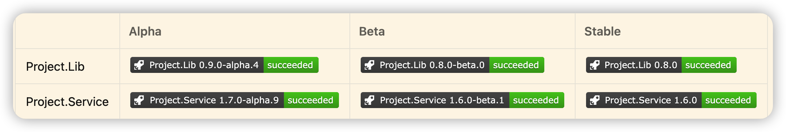
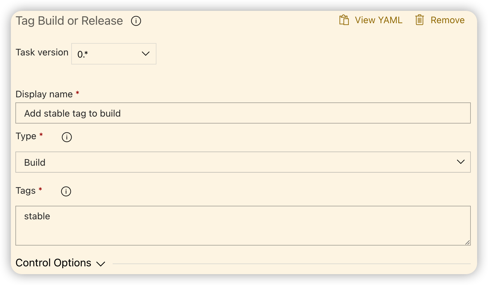

# azure-repo-badge-proxy

Example badges:



## Prerequisites

1.  `GitVersion.Tool` is installed as a dotnet tool
1.  Run the gitversion dotnet CLI command in pipelines.

    ```
    dotnet gitversion /updateassemblyinfo /output buildserver
    ```
    This task will update the build number so `alpha` and `beta` can be searched with wildcards.
1.  Stable builds doesn't have a searchable keyword. An alternative is to [add a stable tag to the build](https://github.com/colindembovsky/cols-agent-tasks/tree/main/Tasks/TagBuild).
    


## Alpha build badge

```

```

## Beta build badge

```

```

## Stable build badge

```

```